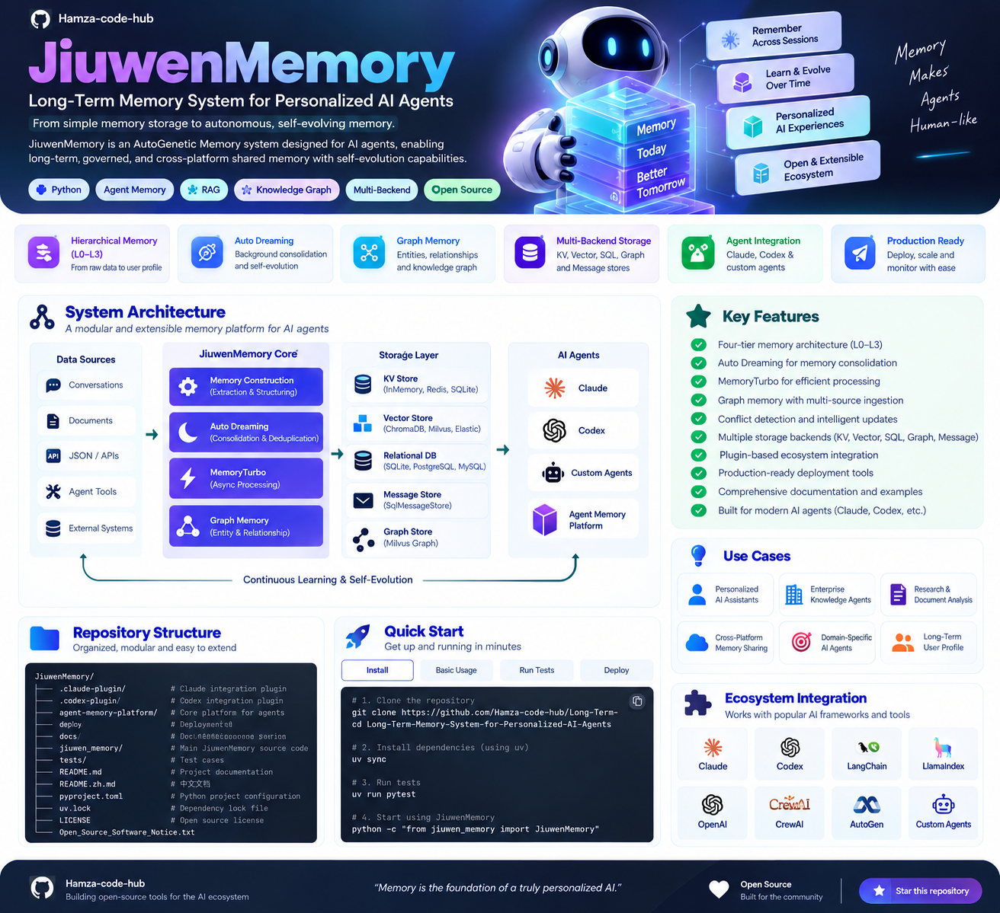
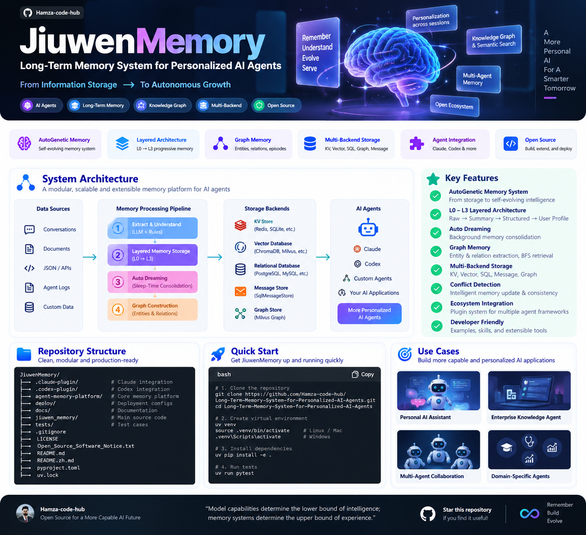
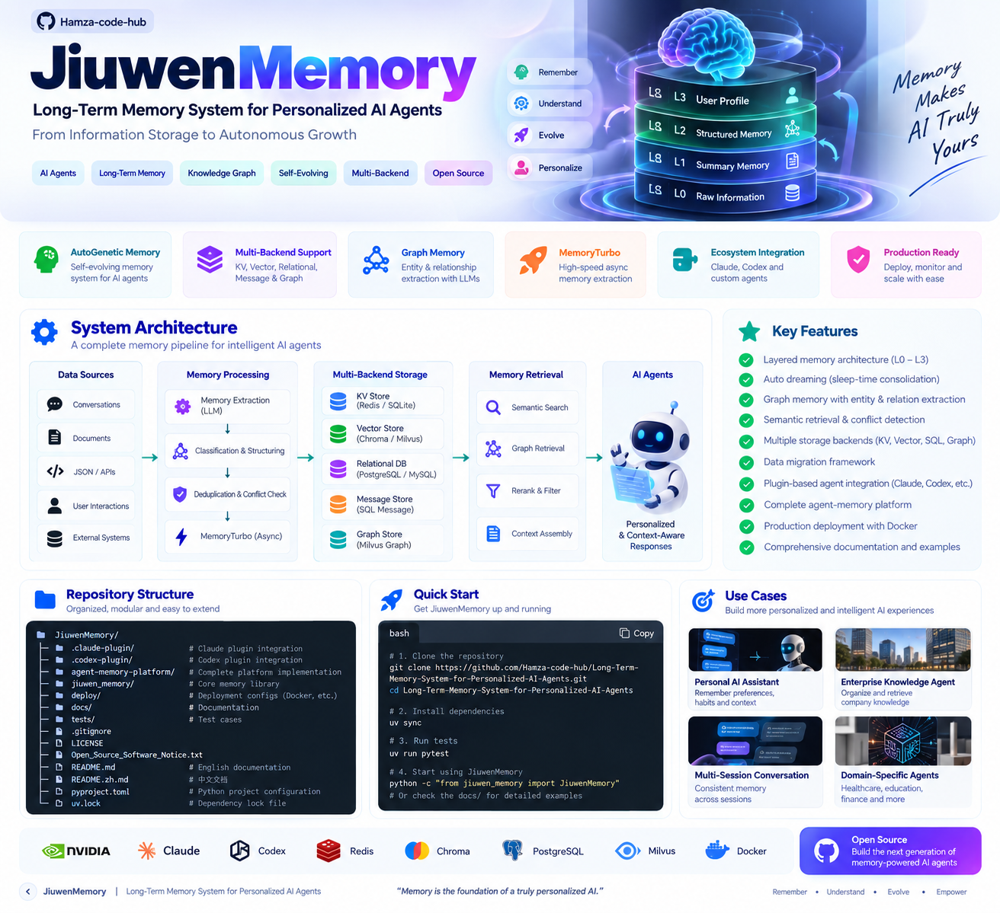
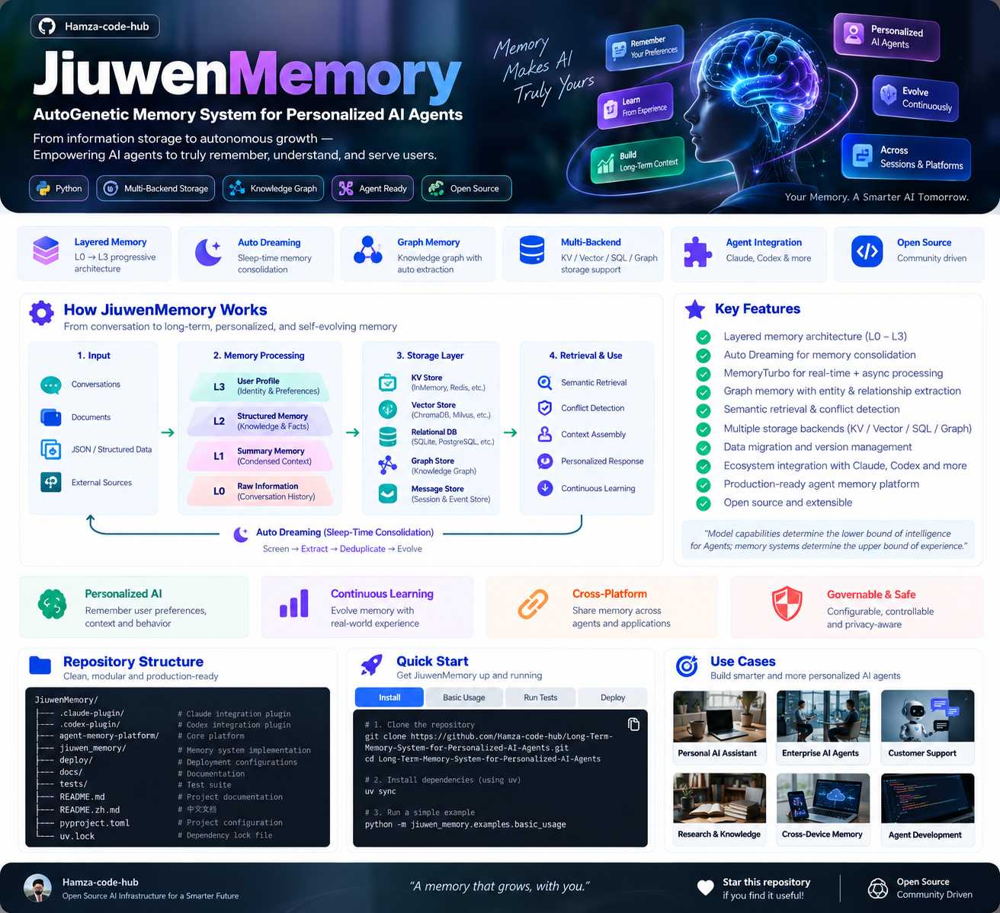

# JiuwenMemory — Long-Term Memory for Personalized AI Agents

<p align="center">
  
</p>

<p align="center">
  <strong>From short-lived context to persistent, searchable, governable agent memory.</strong><br/>
  A modular long-term memory system with layered memory construction, background consolidation, graph memory, multi-backend storage, secure multi-tenant operation, REST/MCP services, and agent integrations.
</p>

<p align="center">
  <a href="#overview">Overview</a> •
  <a href="#why-jiuwenmemory">Why JiuwenMemory</a> •
  <a href="#memory-architecture">Architecture</a> •
  <a href="#memory-lifecycle">Memory Lifecycle</a> •
  <a href="#storage--retrieval">Storage</a> •
  <a href="#memory-services">Services</a> •
  <a href="#quick-start">Quick Start</a> •
  <a href="#security--isolation">Security</a> •
  <a href="#license">License</a>
</p>

<p align="center">
  
  
  
  
  
  
</p>

---

## Overview

**JiuwenMemory** is an **AutoGenetic Memory** system designed for AI agents that need to preserve useful information across long conversations, sessions, and applications.

Traditional conversational agents lose context when:

- the model context window is exceeded
- a conversation restarts
- the same user returns in a later session
- user preferences change over time
- previously learned facts conflict with new information

JiuwenMemory addresses this by turning memory into a structured, persistent system rather than a passive transcript store.

Its core design goals are:

- **precision** — extract durable facts without treating every message as permanent memory
- **efficiency** — avoid expensive synchronous extraction on every interaction
- **consistency** — detect conflicts and manage updates safely
- **portability** — expose memory through APIs, plugins, providers, and MCP
- **governance** — isolate tenants, encrypt sensitive data, and control writes

---

## Why JiuwenMemory

<p align="center">
  
</p>

JiuwenMemory is built around several complementary memory mechanisms rather than a single vector database.

| Capability | Purpose |
|---|---|
| **L0–L3 layered memory** | Progressively transform raw interactions into denser, more useful memory. |
| **Auto Dreaming** | Revisit stored sessions in the background to consolidate missed or fragmented information. |
| **MemoryTurbo** | Decouple fast conversation writes from slower extraction work. |
| **Semantic retrieval** | Search memories by meaning across memory types. |
| **Conflict detection** | Detect incompatible memories before updating long-term state. |
| **Graph Memory** | Extract entities, relationships, and episodes for graph-structured recall. |
| **Multi-backend storage** | Support KV, vector, relational, message, and graph stores. |
| **Agent adapters** | Connect memory to different agent platforms through decoupled plugin/provider layers. |
| **REST + MCP access** | Make memory available to services and MCP-compatible AI clients. |
| **Security controls** | Encrypt data, isolate tenants, and coordinate concurrent writes. |

---

## Memory Architecture

<p align="center">
  
</p>

The core architecture separates **memory processing**, **memory management**, **storage**, **retrieval**, **graph memory**, and **external integrations**.

```text
Conversations / Documents / JSON
               │
               ▼
       Memory Processing
  extraction • analysis • refine
               │
               ▼
       Memory Management
 write • update • conflict check
               │
      ┌────────┼────────┐
      ▼        ▼        ▼
   Vector     SQL      KV / Message
      │        │        │
      └────────┼────────┘
               ▼
        Retrieval Layer
 semantic • graph • rerank
               │
               ▼
        Agent Context
```

The architecture also includes:

- independent Graph Memory
- versioned migration support
- distributed locking
- encrypted configuration and memory data
- external `MemoryProvider` adapters
- REST and MCP service layers

---

## Memory Lifecycle

<p align="center">
  
</p>

### L0 — Raw Information

The original conversation is preserved as the foundation layer.

```text
user message
assistant message
session metadata
```

### L1 — Summary Memory

Conversation history is compressed into shorter summaries that retain useful context while reducing token cost.

### L2 — Structured Memory

The system extracts structured units such as:

- `SemanticMemory`
- `EpisodicMemory`
- `Variable`

This layer represents reusable knowledge, facts, events, and state.

### L3 — User Profile

Higher-level, consolidated user characteristics are maintained as a persistent profile.

Examples include:

- identity information
- preferences
- long-term interests
- stable relationships
- recurring behavior
- explicit positive or negative preferences

---

## Auto Dreaming

Online extraction only sees a limited interaction window. **Dreaming** provides an offline consolidation path that periodically re-reads stored sessions and promotes durable knowledge.

The lifecycle follows a three-stage model:

```text
Light Sleep
   ↓
screen candidate sessions
   ↓
REM
   ↓
extract and classify durable knowledge
   ↓
Deep Sleep
   ↓
deduplicate, resolve conflicts, consolidate
```

Important properties include:

- background scheduling
- checkpoint-based incremental scanning
- configurable sweep intervals
- session filters and extraction limits
- busy-system deferment
- user-level write locking
- reuse of the same memory write and conflict-resolution path

Dreamed memories are normal user-profile, semantic, or episodic memories; they are not stored as a separate special type.

---

## MemoryTurbo

**MemoryTurbo** reduces the latency cost of memory extraction by separating immediate writes from heavier background processing.

```text
Conversation
    │
    ├──► cache / searchable raw memory
    │
    └──► asynchronous extraction pipeline
              │
              ▼
        topic grouping
              │
              ▼
       structured memory
```

This allows retrieval to work before full background extraction has completed.

The design includes:

- immediate cache-layer writes
- asynchronous memory extraction
- topic grouping using smaller models
- merged retrieval across cache and extracted memory

---

## Storage & Retrieval

JiuwenMemory supports multiple storage categories.

### KV

- In-memory KV
- Shelve
- database-backed KV
- Redis

### Vector

- ChromaDB
- Milvus
- Elasticsearch
- GaussVector

### Relational

- SQLite
- PostgreSQL
- MySQL
- GaussDB

### Message

- SQL-backed message store

### Graph

- Milvus-based GraphStore

This allows deployments to move from local single-node development to distributed backends without changing the conceptual memory model.

---

## Semantic Retrieval & Conflict Detection

Memory lookup uses embedding-based semantic retrieval rather than keyword matching alone.

Before writes are finalized, `MemUpdateChecker` can analyze new information against existing memory and decide whether the operation should behave like:

```text
ADD
UPDATE
DELETE
```

LLM-generated update/delete instructions are validated through semantic checks before execution.

This helps prevent common long-term memory problems such as:

- duplicated facts
- outdated preferences
- contradictory profile information
- uncontrolled destructive updates

---

## Graph Memory

Graph Memory is an independent memory subsystem for relationship-rich information.

It supports input from:

- conversations
- documents
- JSON strings

Graph construction includes:

```text
Source Episode
      ↓
Entity Extraction
      ↓
Relation Extraction
      ↓
Entity Merge
      ↓
Relation Deduplication
      ↓
Graph Storage
```

Retrieval can search:

- entities
- relationships
- source episodes

and can apply:

- hybrid ranking
- reranking
- BFS expansion

Graph Memory is currently independent from the normal `LongTermMemory.add_messages` pipeline.

---

## Security & Isolation

JiuwenMemory includes controls for deployments that persist sensitive user context.

### AES-256-GCM

Memory data and API keys can be transparently encrypted.

### Distributed Locking

A KV-backed distributed lock coordinates user-level writes across multiple service instances.

### Multi-Tenant Scope Isolation

Each `scope_id` can have independent:

- memory data
- LLM configuration
- embedding configuration
- extraction rules

Configuration is stored separately and encrypted to preserve tenant isolation.

---

## Agent & Provider Integration

JiuwenMemory decouples agent platforms from memory providers across two dimensions.

### Plugin Dimension

Hook-based integrations can inject memory before replies and capture new exchanges afterward.

### Provider Dimension

The unified `MemoryProvider` interface allows memory engines to be swapped without rewriting agent code.

Supported integrations described by the project include:

- JiuwenMemory
- Mem0
- openViking
- AgentArts
- openJiuwen

The two adapter dimensions can evolve independently.

---

## Memory Services

### REST Memory Service

Install the service extras:

```bash
pip install JiuwenMemory[server]
```

Create the configuration directory:

```bash
mkdir -p ~/.jiuwenmemory
cp server/.env.example ~/.jiuwenmemory/.env
```

Then start the service:

```bash
memory-server
```

The service exposes capabilities for:

- adding messages
- memory CRUD
- key-value variable management
- semantic retrieval

Configuration and runtime data are stored under:

```text
~/.jiuwenmemory/
├── .env
└── memory_data/
```

---

## MCP Service

The same memory engine can be exposed through **Model Context Protocol**.

Install:

```bash
pip install JiuwenMemory[server]
```

Run:

```bash
memory-mcp
```

Default endpoint:

```text
http://127.0.0.1:8765/mcp
```

Available tool categories include:

- `add_messages`
- `search_memories`
- `search_history_summaries`
- `get_memories`
- `update_memory`
- `delete_memory`
- `delete_all_memories`
- `health_check`

This allows MCP-compatible AI clients to use memory without custom HTTP integration code.

---

## Quick Start

### Requirements

- Windows, Linux, or macOS
- Python `>=3.11,<3.14`
- Python 3.11.x recommended by the project

### Install

```bash
pip install -U JiuwenMemory
```

### Optional Backends

```bash
pip install JiuwenMemory[sqlite]
pip install JiuwenMemory[postgres]
pip install JiuwenMemory[mysql]
pip install JiuwenMemory[gaussdb]
pip install JiuwenMemory[redis]
pip install JiuwenMemory[chromadb]
pip install JiuwenMemory[file-index]
pip install JiuwenMemory[server]
```

Install all optional storage/server dependencies:

```bash
pip install JiuwenMemory[all]
```

---

## Minimal Usage Pattern

A typical application lifecycle is:

```text
1. Create LongTermMemory
2. Register storage backends
3. Configure LLM and embedding providers
4. Create a scope
5. Enable desired memory types
6. Add conversation messages
7. Search memories semantically
```

Example:

```python
from jiuwen_memory.memory_core import LongTermMemory

memory = LongTermMemory()
```

A full example requires registered storage, embedding, model, and scope configurations.

---

## File-System Memory Backend

JiuwenMemory can persist long-term memories as human-readable Markdown files.

Install:

```bash
pip install JiuwenMemory[file-index]
```

Then register the memory store with:

```python
await memory.register_store(
    kv_store=kv_store,
    db_store=db_store,
    embedding_model=embedding_model,
    index_backend="file",
    file_root_dir="./file_memory_data",
)
```

The file backend combines human-readable memory files with an SQLite-based index.

---

## Repository Structure

The repository is organized around integrations, the core memory package, deployment, documentation, and tests.

```text
JiuwenMemory/
├── .claude-plugin/             # Claude integration
├── .codex-plugin/              # Codex integration
├── agent-memory-platform/      # agent memory platform assets
├── deploy/                     # deployment configuration
├── docs/                       # documentation
├── jiuwen_memory/              # core Python memory system
├── tests/                      # automated tests
├── LICENSE
├── Open_Source_Software_Notice.txt
├── README.md
├── README.zh.md
├── pyproject.toml
└── uv.lock
```

Inside the main package, the architecture includes:

```text
jiuwen_memory/
├── memory_core/
│   ├── config/
│   ├── manage/
│   ├── process/
│   │   ├── extract/
│   │   ├── dreaming/
│   │   └── refine/
│   ├── graph/
│   ├── prompts/
│   ├── codec/
│   ├── migration/
│   ├── external/
│   └── common/
├── foundation/
│   ├── llm/
│   ├── store/
│   ├── prompt/
│   └── tool/
├── retrieval/
├── common/
└── server/
```

---

## Data Migration

The project includes versioned migration support for:

- SQL schema changes
- vector field updates
- KV data changes
- message-store transformations
- index operations
- cross-`BaseMemoryIndex` migration

Custom migration operations can be added through the migration registry.

---

## LLM Provider Support

The project includes model-client support for multiple providers and routing systems, including:

- OpenAI-compatible providers
- DashScope
- DeepSeek
- SiliconFlow
- OpenRouter
- InferenceAffinity
- IntelliRouter

This keeps memory processing independent from a single inference vendor.

---

## Deployment Model

JiuwenMemory can be used in several forms:

```text
Python Library
      │
      ├── embedded directly in an agent service
      │
      ├── exposed as REST memory service
      │
      ├── exposed as MCP service
      │
      └── integrated through plugins/providers
```

A typical production-style deployment can separate:

- agent runtime
- memory API/MCP runtime
- relational storage
- vector storage
- Redis/KV
- background Dreaming workers

---

## Design Principles

The project is built around a few important memory-system principles:

- **memory is not the transcript**
- **short-term interaction and long-term knowledge should be separated**
- **not every message deserves permanent storage**
- **memory updates require conflict detection**
- **background consolidation can recover missed knowledge**
- **retrieval should work across memory types**
- **storage should remain replaceable**
- **tenant boundaries must remain explicit**
- **agents should consume memory through stable interfaces**

---

## License

JiuwenMemory is licensed under the **Apache-2.0 License**.

The repository also includes an open-source software notice for third-party components.

---

<p align="center">
  <strong>Memory turns isolated interactions into continuous agent experience.</strong>
</p>
